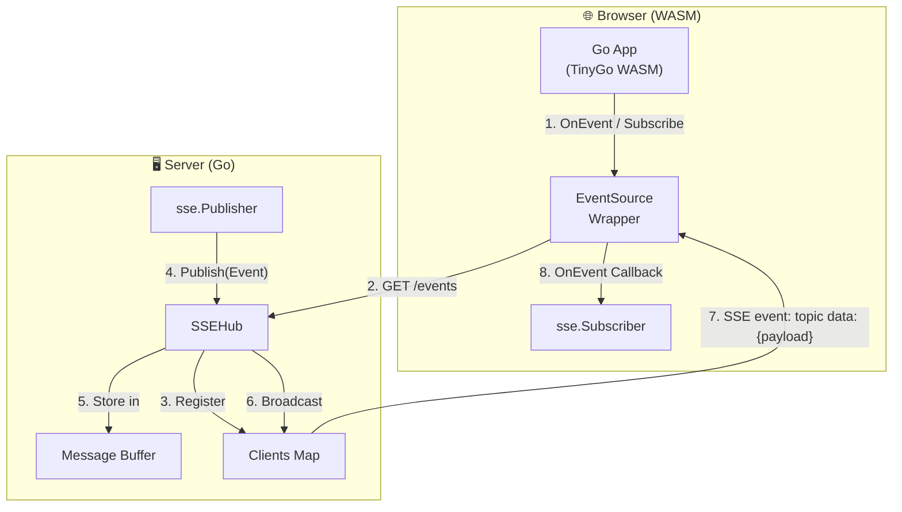
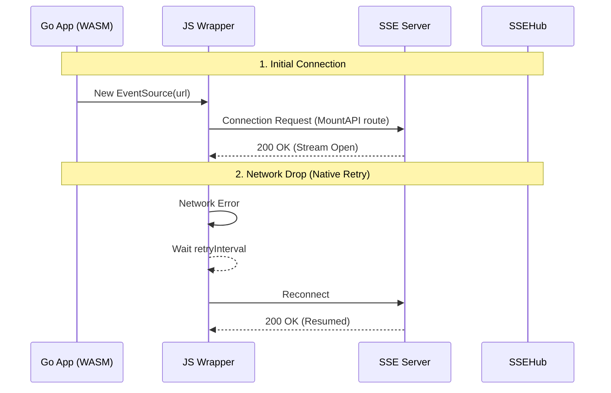
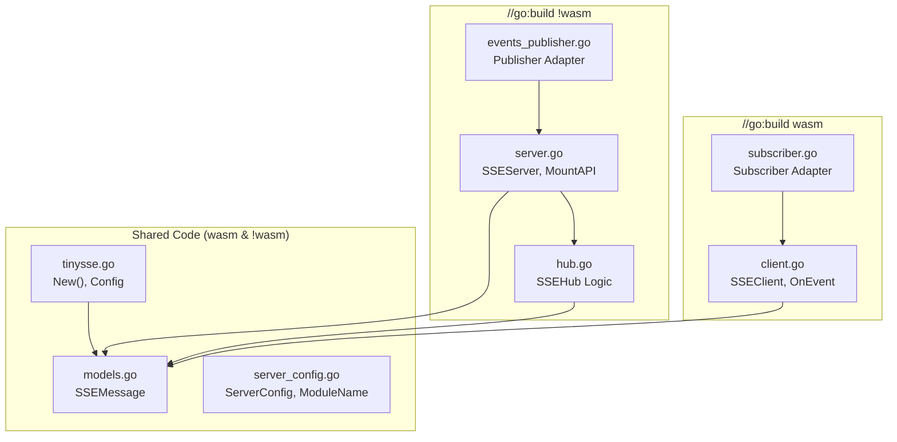

# TinySSE Architecture

> **Package:** `webtyp.com/sse`

## System Overview

`SSEServer` implements `router.APIModule` (`ModelName()` and `MountAPI(r)`), mounting itself as a streaming route with configured path and access gate (`model.Access`).

## Connection Flow (Hybrid Reconnection)

## File Structure & Build Constraints

## Key Design Decisions

| Aspect | Decision | Reason |
|--------|----------|--------|
| **Mounting** | **`router.APIModule`** | `MountAPI` registers streaming route with `Path`, `Access`, `Resource`. |
| **Browser Events** | **Named `addEventListener`** | Browser `OnMessage` only handles unnamed events; `OnEvent` registers named SSE handlers. |
| **Pub/Sub Adapters** | **`Publisher` & `Subscriber`** | Adapter pattern to `events.Publisher` and `events.Subscriber`. |
| **Hub Location** | **Server-Only** | Reduce WASM binary size. Client is single-connection. |
| **Protocol** | **SSE Standard** | `event: ...\ndata: ...\n\n` for standard browser `EventSource` dispatch. |
| **HTTP/2 Transport** | **No hop-by-hop headers** | RFC 9113 §8.2.2 prohibits `Connection` in HTTP/2. TinySSE emits only `Content-Type: text/event-stream` and `Cache-Control: no-cache`. |

